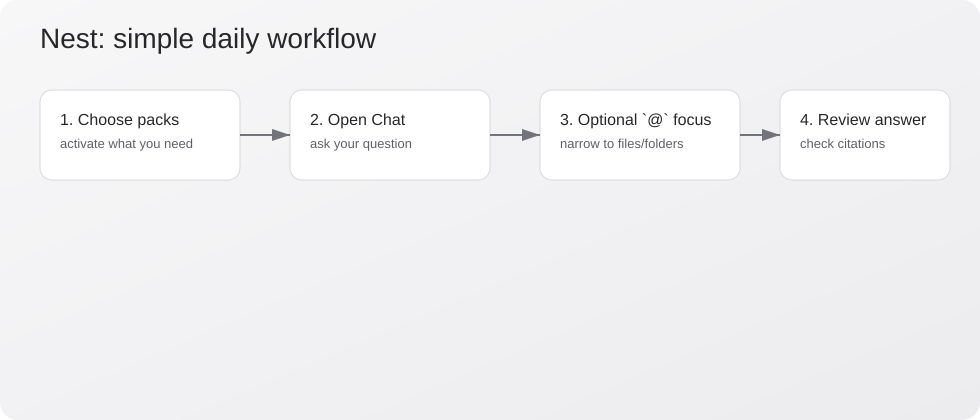

# Nest 使用入门

欢迎使用 Nest. 这个知识包随应用一起提供, 用于帮助你快速上手.

## 从这里开始

1. [前 10 分钟](guides/first-10-minutes.md)
2. [设置说明](guides/settings-reference.md)
3. [资料库与知识包工作流](guides/library-and-pack-workflows.md)
4. [聊天与 `@` 聚焦工作流](guides/chat-and-focus-workflows.md)
5. [Markdown 语法与高亮](guides/markdown-syntax-and-highlighting.md)
6. [故障排查](guides/troubleshooting.md)

## 核心概念

- [如何使用 Nest](concepts/how-nest-works.md)

## 快速示意图

## 说明

- 首次启动时, 该知识包默认处于激活状态.
- 同时也提供英文版本知识包 (`getting-started`).
- 你可以在 Hub -> Installed 中随时删除它.
- 删除后, 应用不会自动重新安装.
