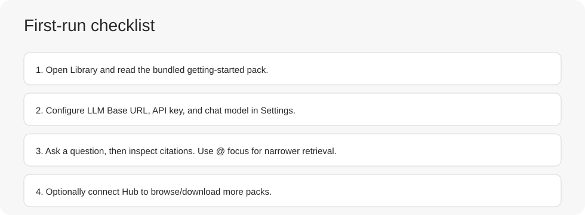

# First 10 Minutes

This walkthrough takes you from launch to useful answers.

## 1) Open Library

- Expand the preinstalled `getting-started` pack.
- Open this page and confirm markdown renders correctly.

# 前 10 分钟

本指南帮助你从首次打开快速进入可用状态.

## 1) 打开 Library

- 展开预装的 `getting-started-zh` 知识包.
- 打开本页, 确认 Markdown 显示正常.

## 2) 配置 Settings

进入 Settings 并填写:

- LLM Base URL
- API key
- Chat model

可选项:

- Hub Base URL (如果你要连接远程目录)
- 你的显示名称
- 字体大小
- 本地知识目录

## 3) 提出第一个问题

打开 Chat 并提问:

```text
请总结已激活与未激活知识包对回答结果的影响.
```

然后查看引用来源, 确认回答引用了哪些文件.

## 4) 尝试 `@` 聚焦

在 Chat 中输入 `@`, 从已激活知识包选择文件或文件夹. 例如:

```text
@getting-started-zh/guides 如何导入本地知识包 zip?
```

## 5) 可选: 连接 Hub

如果你运行了 Hub 服务, 设置 Hub Base URL 后打开 Hub:

- Browse: 查找并下载远程知识包
- Installed: 升级、删除、管理激活状态

## 6) 检查配置是否完成

- 确认至少有一个知识包处于激活状态.
- 分别提一个宽泛问题和一个 `@` 聚焦问题.
- 如果后续还会使用这个会话, 可以 pin 或保留.


