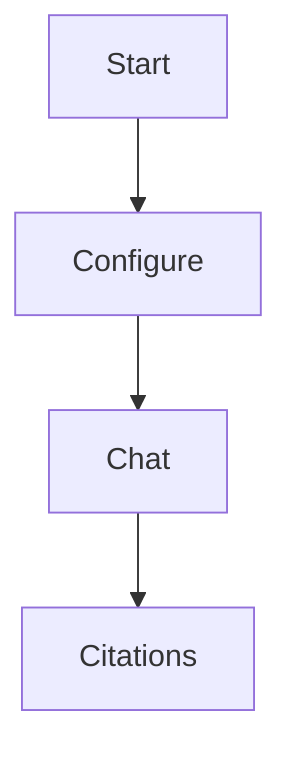

# Markdown 语法与高亮

Nest 支持 GitHub Flavored Markdown, 并提供代码高亮.

## 支持的 markdown 功能

- 标题 (`#` 到 `######`)
- 段落、斜体、加粗
- 有序列表与无序列表
- 引用块
- 表格 (GFM)
- 任务列表 (GFM)
- 删除线 (GFM)
- 围栏代码块
- 行内代码
- 分隔线
- 链接与自动链接
- 图片 (相对路径或外链)

## 代码高亮

当代码块语言可识别时, 会自动高亮.

```ts
export function hello(name: string) {
  return `hello ${name}`;
}
```

如果语言未识别, 仍会以普通代码块显示.

## Mermaid 图表

可使用 `mermaid` 代码块:



## 图片引用

相对路径会基于当前 Markdown 文件解析.

```md

```

支持的本地图片类型:

- `png`
- `jpg` / `jpeg`
- `gif`
- `webp`
- `svg`
- `bmp`

## 转义提示

- 路径里有空格时, 按需使用标准链接/图片语法处理.
- 如果要显示 markdown 特殊符号本身, 可以用反斜杠转义.


