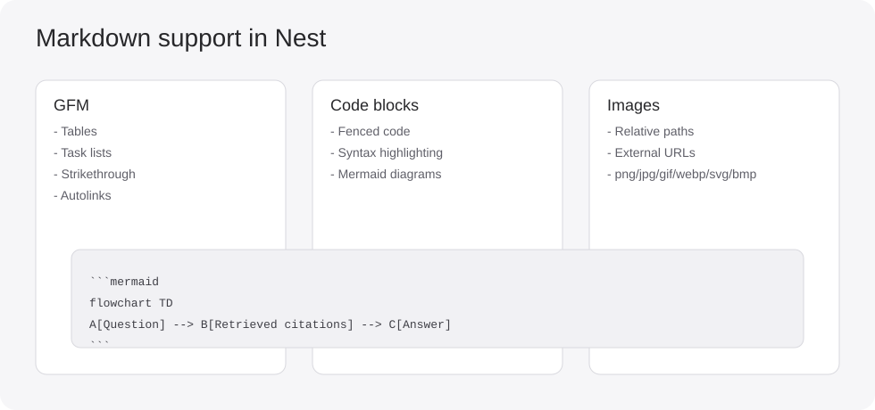

# Getting Started with Nest

Welcome to Nest. This pack is bundled with the app so you can quickly learn how to use the product.

## Start here

1. [First 10 minutes](guides/first-10-minutes.md)
2. [Settings reference](guides/settings-reference.md)
3. [Library and pack workflows](guides/library-and-pack-workflows.md)
4. [Chat and `@` focus workflows](guides/chat-and-focus-workflows.md)
5. [Markdown syntax and highlighting](guides/markdown-syntax-and-highlighting.md)
6. [Troubleshooting](guides/troubleshooting.md)

## Concepts

- [How Nest works](concepts/how-nest-works.md)

## Quick illustrations

## Notes

- This pack is active by default on first launch.
- A Chinese counterpart pack (`getting-started-zh`) is also bundled.
- You can remove it from Hub -> Installed at any time.
- If you remove it, Nest does not auto-reinstall it later.
