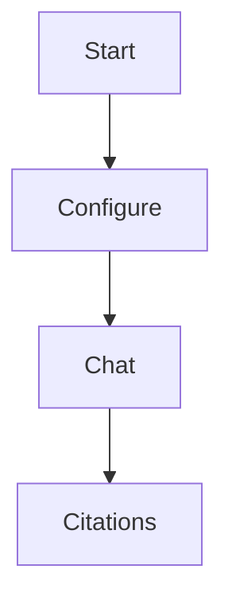

# Markdown Syntax and Highlighting

Nest supports GitHub Flavored Markdown with code highlighting.

## Supported markdown features

- Headings (`#` to `######`)
- Paragraphs, emphasis, strong text
- Ordered and unordered lists
- Blockquotes
- Tables (GFM)
- Task lists (GFM)
- Strikethrough (GFM)
- Fenced code blocks
- Inline code
- Horizontal rules
- Links and autolinks
- Images (relative and external)

## Syntax highlighting

Fenced code blocks are highlighted when language is recognized.

```ts
export function hello(name: string) {
  return `hello ${name}`;
}
```

If language is unknown, code still renders in a plain block.

## Mermaid diagrams

Use fenced `mermaid` blocks:



## Image references

Relative references are resolved from the current markdown file.

```md

```

Supported local image types:

- `png`
- `jpg` / `jpeg`
- `gif`
- `webp`
- `svg`
- `bmp`

## Escaping tips

- Wrap paths with spaces in link/image syntax as needed.
- For literal markdown punctuation, escape with backslash.


