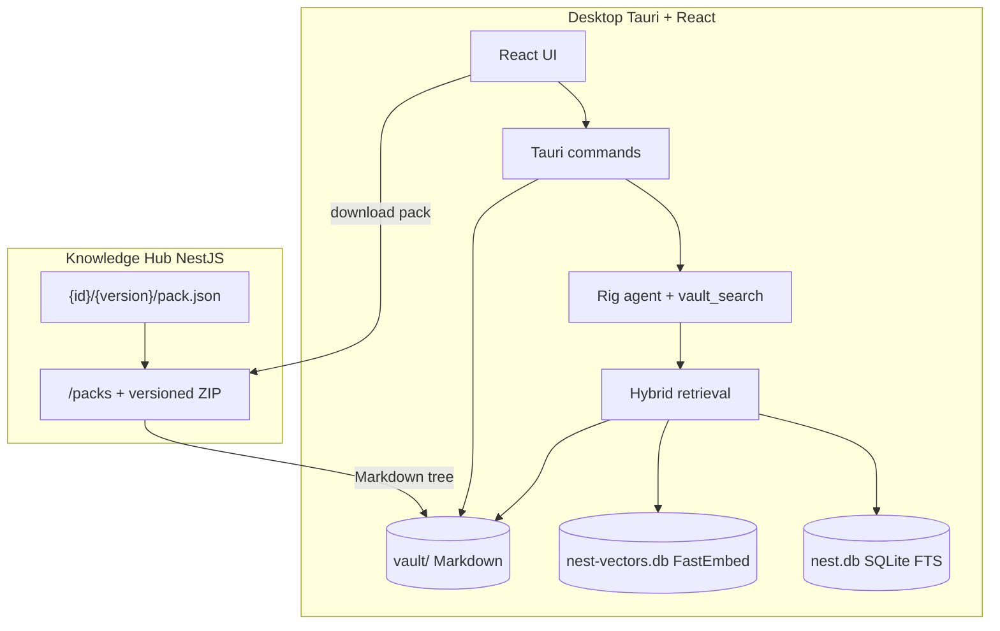

# Architecture

Nest is a **local-first** knowledge workspace: Markdown packs live on disk in a vault, retrieval and chat run in the desktop app, and a small Knowledge Hub only catalogs and distributes packs.

## Components

| Piece | Path | Role |
|-------|------|------|
| Desktop UI | `apps/desktop/src` | Library, Hub, Settings, Chat |
| Desktop backend | `apps/desktop/src-tauri` | Vault I/O, index, RAG, LLM, sessions |
| Shared types | `packages/shared` | TypeScript contracts shared with the UI |
| Knowledge Hub | `apps/hub` | Pack catalog + ZIP download |
| Fixtures | `fixtures/knowledge` | PyPI-style registry `{id}/{semver}/`; see [pack-registry.md](pack-registry.md) |

## Knowledge Hub connectivity

The desktop app uses the configured remote Hub (`Settings → Hub URL`, default `http://127.0.0.1:8787`).

- Catalog and download use a **PyPI-style versioned registry** (`GET /packs`, `GET /packs/:id/:version/download`). See [pack-registry.md](pack-registry.md).
- If the Hub is unreachable, the Hub panel shows an **Offline** status. Local **Import** (zip) still works.
- Fixture folders under `fixtures/knowledge` are `{id}/{semver}/` trees served by the **Hub process** only.

## Vault and indexing

- Packs install into `{app_data}/vault/<pack-id>/` as a single active version (upgrade replaces the tree).
- **Import local pack** accepts a `.zip` with `pack.json` (`id`, `name`, `description`, `version`; `path` optional and must equal `id`).
- **Remove pack** deletes the tree, purges SQLite/FTS rows, and rebuilds the vector index.

## Retrieval (RAG)

Hybrid retrieval in `retrieval.rs`:

1. **Vector search** on FastEmbed embeddings (`nest-vectors.db`)
2. **FTS5** lexical search in `nest.db`
3. Lexical fallback if both are empty
4. Drop citations whose files no longer exist under the vault

Default top-k is fixed in the backend (`DEFAULT_TOP_K`), not user-configurable.

Chat uses a Rig agent with multi-turn memory and a `vault_search` tool; completions go to the user’s OpenAI-compatible LLM (Settings).

## Persistence

Under the OS app data directory for `com.nest.app`:

| Store | Purpose |
|-------|---------|
| `vault/` | Downloaded Markdown packs |
| `nest.db` | Settings, sessions, messages, FTS chunks, sync state |
| `nest-vectors.db` | Local vector index |

Open chat tabs (which sessions appear in the tab bar) are persisted in the UI via zustand + `localStorage`, not in SQLite.

## Streaming chat

1. Frontend listens to a Tauri event channel (`chat-stream-*`).
2. Backend emits reading / generating / token / done / error events.
3. Token text is buffered and flushed **once per animation frame** so React does not re-render on every token.
4. On success, the assistant message is seeded into the React Query cache, then the stream buffer is cleared (no per-word motion trees).

LLM session titles generate in the background after the first reply so they do not block returning the assistant message.
