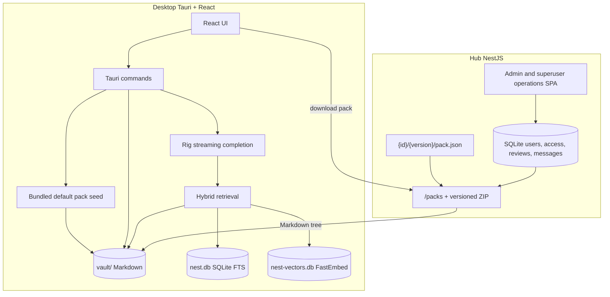

# Architecture

Nest is a **local-first** knowledge workspace: Markdown packs live on disk in a vault and retrieval/chat run in the desktop app. The optional Hub is an independently deployable account, publishing, messaging, and registry service.

## Components

| Piece           | Path                       | Role                                                                           |
| --------------- | -------------------------- | ------------------------------------------------------------------------------ |
| Desktop UI      | `apps/desktop/src`         | Library, Hub, Messages, Settings, Chat                                         |
| Desktop backend | `apps/desktop/src-tauri`   | Vault I/O, index, RAG, LLM, sessions                                           |
| Shared types    | `packages/shared`          | Canonical snake_case wire contracts shared by the TypeScript applications      |
| Hub service     | `apps/hub`                 | Accounts, review workflow, access control, pack catalog, and ZIP download       |
| Admin console   | `apps/admin`               | Hub operations UI built separately and served by Hub at `/admin`                |
| Examples        | `examples/knowledge-packs` | PyPI-style registry `{id}/{semver}/`; see [pack-registry.md](pack-registry.md) |

## Hub connectivity

The desktop app uses the configured Hub URL from Settings. The Hub service listens on `HOST`/`PORT` from its `.env`; the desktop setting supplies the full base URL.

Authentication is optional. Public catalog and download behavior stays anonymous; the desktop stores an authenticated refresh credential in the operating-system credential store only when a user signs in to publish or access restricted packs. Previously downloaded restricted content remains ordinary local vault content offline.

Hub sign-in and registration live in **Settings** so browsing local and public content never looks gated. The top-level **Messages** page shows durable publish-submitted, approved, and rejected notices as a compact list with unread and deletion controls; it polls every 30 seconds while signed in and also has a manual refresh button, as does the Hub tab.

The Hub has three authorization levels: regular users, admins, and one environment-managed superuser. Admins and the superuser share registry review and pack-management permissions. Admins may promote users and delete regular accounts; the superuser may also delete admins. The adopted superuser identity is persistently locked against profile, password, role, and deletion changes.

- Catalog and download use a **PyPI-style versioned registry** (`GET /packs`, `GET /packs/:id/:version/download`). See [pack-registry.md](pack-registry.md).
- The Hub panel has two tabs: **Browse** (remote registry: search + download) and **Installed** (everything in the local vault, with origin badges and upgrade/remove actions).
- If the Hub service is unreachable, the Hub panel shows an **Offline** status and Browse offers a connect/import empty state. The Installed tab and local **Import** (zip) still work.
- Example-pack folders under `examples/knowledge-packs` are `{id}/{semver}/` trees served by the **Hub process** only — the desktop does not fall back to them when offline.

On first launch, desktop seeds a local bundled `getting-started` pack into the vault. This does not require Hub connectivity.

## Vault and indexing

- Packs install into the configured **knowledge directory** (default `{app_data}/vault/<pack-id>/`; upgrade replaces the tree).
- Installed-pack state records whether content was created/imported locally, downloaded from the registry, bundled with Nest, or predates origin tracking. Only locally created or imported packs can be published.
- A bundled default `getting-started` pack is copied once into the vault on first launch, recorded in `sync_state`, and marked active by default.
- **Import local pack** accepts a `.zip` with `pack.json` (`id`, `name`, `description`, `version`; `path` optional and must equal `id`).
- Importing a ZIP or creating from a folder with an installed pack ID requires explicit replacement confirmation; Nest keeps exactly one installed version per ID.
- **Remove pack** deletes the tree, purges SQLite/FTS rows, and rebuilds the vector index.
- Pack mutations queue a coalesced background index rebuild. If another mutation occurs while indexing, one more generation runs after the active rebuild; install/import dialogs do not wait for model loading or embedding.

The bundled pack can be deleted by the user; a first-run marker prevents reseeding on later launches.

## Library: active / inactive packs

Installed packs have an `active` flag in `sync_state` (default on after install).

| State        | Library                               | Chat / RAG                                               |
| ------------ | ------------------------------------- | -------------------------------------------------------- |
| **Active**   | Shown in the main tree                | Included in default retrieval and `@` mention candidates |
| **Inactive** | Collapsible accordion; still readable | Excluded from RAG until reactivated                      |

Use **+/−** on a pack root to toggle. Multiple packs can be active at once; their roots form the default retrieval domain.

## Chat focus (`@` mentions)

The composer accepts `@` mentions of **files and folders under active packs only**. Mention paths become `focus_paths` on `chat_send`.

Backend resolution (`resolve_retrieval_prefixes`):

1. If `focus_paths` is empty → search all active pack roots.
2. Otherwise → keep only focus paths that lie under an active root (or fall back to all active roots if none match).
3. Valid focused files are read directly; focused folders recursively contribute a bounded set of their Markdown files to the model context. This makes an explicit `@` selection usable even while a newly installed pack is still being indexed.
4. Directly focused files become structured references and share the same `[n]` numbering, persistence, and References accordion as indexed retrieval results.

Inactive packs never contribute passages, even if `@`-mentioned somehow.

## Retrieval (RAG)

Hybrid retrieval in `retrieval.rs`:

1. **Vector search** on FastEmbed embeddings (`nest-vectors.db`)
2. **FTS5** lexical search in `nest.db`
3. Lexical fallback if both are empty
4. Drop citations whose files no longer exist under the vault

Results are filtered by the resolved retrieval prefixes. Default top-k is fixed in the backend (`DEFAULT_TOP_K`), not user-configurable. Embedding model is fixed to `AllMiniLML6V2Q`.

Chat passes a bounded multi-turn history, direct `@` focus content, and eagerly retrieved evidence to one Rig streaming completion; completions go to the user’s OpenAI-compatible LLM (Settings). Avoiding a second model-driven retrieval turn keeps reasoning-model streams compatible across OpenAI-style gateways.

## Markdown rendering

The desktop viewer renders Markdown with:

- `remark-gfm` (tables, task lists, strikethrough, autolinks)
- `rehype-highlight` syntax highlighting for common fenced-code languages
- Mermaid rendering for fenced `mermaid` blocks
- Local vault image resolution (`png`, `jpg`, `jpeg`, `gif`, `webp`, `svg`, `bmp`) via a safe Tauri command

## Persistence

Under the OS app data directory for `com.cyborgoat.nest.app`:

| Store                                     | Purpose                                                   |
| ----------------------------------------- | --------------------------------------------------------- |
| Knowledge directory (`vault/` by default) | Downloaded Markdown packs (path configurable in Settings) |
| `nest.db`                                 | Settings, local chat sessions/messages, FTS chunks, sync state |
| `nest-vectors.db`                         | Local vector index                                        |

Open chat tabs (which sessions appear in the tab bar) are persisted in the UI via zustand + `localStorage`, not in SQLite.
Hub accounts, reviews, access grants, audits, and Hub messages live in the Hub's separate SQLite database. They are not required for offline desktop use.

## Streaming chat

1. Frontend listens to a Tauri event channel (`chat-stream-*`).
2. Backend emits reading / generating / token / done / error events.
3. Token text is buffered and flushed **once per animation frame** so React does not re-render on every token.
4. On success, the assistant message is seeded into the React Query cache, then the stream buffer is cleared (no per-word motion trees).

LLM session titles generate in the background after the first reply so they do not block returning the assistant message.
