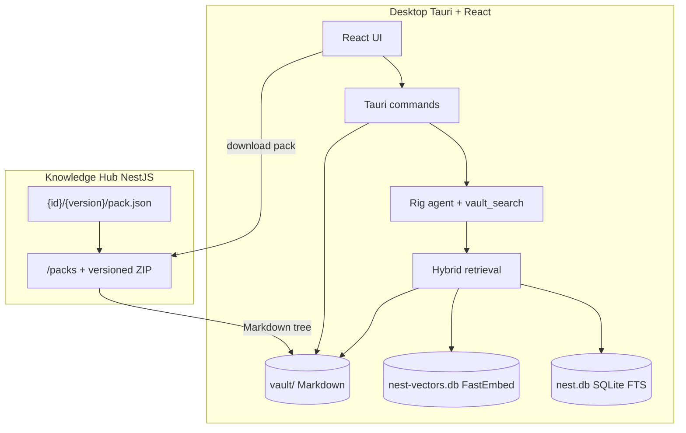

# Architecture

Nest is a **local-first** knowledge workspace: Markdown packs live on disk in a vault, retrieval and chat run in the desktop app, and a small Knowledge Hub only catalogs and distributes packs.

## Components

| Piece | Path | Role |
|-------|------|------|
| Desktop UI | `apps/desktop/src` | Library, Hub, Settings, Chat |
| Desktop backend | `apps/desktop/src-tauri` | Vault I/O, index, RAG, LLM, sessions |
| Shared types | `packages/shared` | TypeScript contracts shared with the UI |
| Knowledge Hub | `apps/hub` | Pack catalog + ZIP download |
| Fixtures | `fixtures/knowledge` | PyPI-style registry `{id}/{semver}/`; see [pack-registry.md](pack-registry.md) |

## Knowledge Hub connectivity

The desktop app uses the configured Hub base URL from Settings. The Hub service only owns the API port; host selection lives in the desktop setting.

- Catalog and download use a **PyPI-style versioned registry** (`GET /packs`, `GET /packs/:id/:version/download`). See [pack-registry.md](pack-registry.md).
- The Hub panel has two tabs: **Browse** (remote registry: search + download) and **Installed** (everything in the vault, with origin badges and upgrade/remove actions).
- If the Hub is unreachable, the Hub panel shows an **Offline** status and Browse offers a connect/import empty state. The Installed tab and local **Import** (zip) still work.
- Fixture folders under `fixtures/knowledge` are `{id}/{semver}/` trees served by the **Hub process** only — the desktop does not fall back to fixtures when offline.

## Vault and indexing

- Packs install into the configured **knowledge directory** (default `{app_data}/vault/<pack-id>/`; upgrade replaces the tree).
- **Import local pack** accepts a `.zip` with `pack.json` (`id`, `name`, `description`, `version`; `path` optional and must equal `id`).
- **Remove pack** deletes the tree, purges SQLite/FTS rows, and rebuilds the vector index.
- Indexing runs automatically after download, import, and remove.

## Library: active / inactive packs

Installed packs have an `active` flag in `sync_state` (default on after install).

| State | Library | Chat / RAG |
|-------|---------|------------|
| **Active** | Shown in the main tree | Included in default retrieval and `@` mention candidates |
| **Inactive** | Collapsible accordion; still readable | Excluded from RAG until reactivated |

Use **+/−** on a pack root to toggle. Multiple packs can be active at once; their roots form the default retrieval domain.

## Chat focus (`@` mentions)

The composer accepts `@` mentions of **files and folders under active packs only**. Mention paths become `focus_paths` on `chat_send`.

Backend resolution (`resolve_retrieval_prefixes`):

1. If `focus_paths` is empty → search all active pack roots.
2. Otherwise → keep only focus paths that lie under an active root (or fall back to all active roots if none match).

Inactive packs never contribute passages, even if `@`-mentioned somehow.

## Retrieval (RAG)

Hybrid retrieval in `retrieval.rs`:

1. **Vector search** on FastEmbed embeddings (`nest-vectors.db`)
2. **FTS5** lexical search in `nest.db`
3. Lexical fallback if both are empty
4. Drop citations whose files no longer exist under the vault

Results are filtered by the resolved retrieval prefixes. Default top-k is fixed in the backend (`DEFAULT_TOP_K`), not user-configurable. Embedding model is fixed to `AllMiniLML6V2Q`.

Chat uses a Rig agent with multi-turn memory and a `vault_search` tool; completions go to the user’s OpenAI-compatible LLM (Settings).

## Persistence

Under the OS app data directory for `com.cyborgoat.nest.app`:

| Store | Purpose |
|-------|---------|
| Knowledge directory (`vault/` by default) | Downloaded Markdown packs (path configurable in Settings) |
| `nest.db` | Settings, sessions, messages, FTS chunks, sync state |
| `nest-vectors.db` | Local vector index |

Open chat tabs (which sessions appear in the tab bar) are persisted in the UI via zustand + `localStorage`, not in SQLite.

## Streaming chat

1. Frontend listens to a Tauri event channel (`chat-stream-*`).
2. Backend emits reading / generating / token / done / error events.
3. Token text is buffered and flushed **once per animation frame** so React does not re-render on every token.
4. On success, the assistant message is seeded into the React Query cache, then the stream buffer is cleared (no per-word motion trees).

LLM session titles generate in the background after the first reply so they do not block returning the assistant message.
