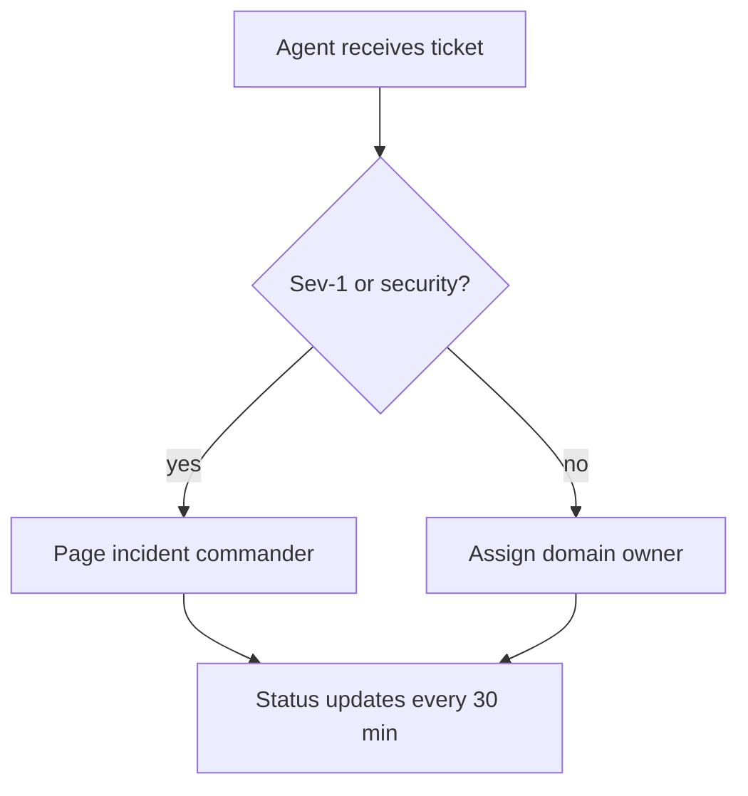

# Escalation Runbook

## Trigger conditions

- Repeated customer impact
- Security/privacy concern
- Data loss or corruption risk

## Escalation flow

## Communication

- Acknowledge quickly
- Share known scope and next update time
- Avoid speculative root causes
