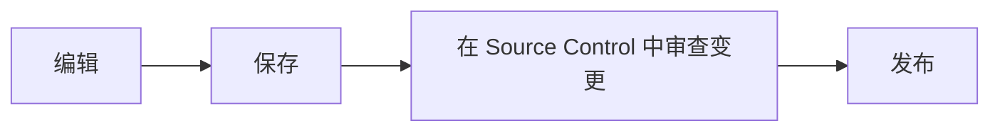

# 编辑与源代码管理

**Source Control** 位于应用最左侧活动栏，图标形状类似分支。把鼠标停在图标上可查看名称。

## 编辑 Markdown

打开文件，在渲染与源代码模式间切换，正常保存。Nest 支持 GitHub Flavored
Markdown：表格、任务列表、围栏代码块、链接、本地图片、Mermaid 图表和 KaTeX
数学公式。行内公式使用 `$E = mc^2$`；块级公式需要将前后的 `$$` 分别单独放在一行。

## 源代码管理会跟踪什么

**Source Control** 通常只跟踪从 Hub 安装且可编辑的知识包。普通本地知识包的修改只保留在
本地，不显示变更状态。如果把本地知识包提交到注册表，其已提交的变更会在审核期间
显示。

变更颜色和状态标记只显示在 **Source Control** 中，不会重复显示在 **Explorer** 中。

## 状态标记

- **M** 已修改 · **A** 新增 · **D** 已删除

**Source Control** 图标上的琥珀色圆点表示存在本地修改。打开变更文件可与同步基线比较。

## 丢弃

丢弃会恢复修改或删除的文件，并移除新增文件——这会撤销未保存的内容，操作前请先
查看差异。

## 发布之后

申请处于审核中时，知识包会被锁定，Markdown 顶部的只读提示会说明是谁提交了申请。
只有原始提交者会在 **Source Control** 中看到前往 **Under Review** 取消申请的链接。

使用 **Source Control** 的刷新按钮。申请获批后会显示 **Merge with remote**。Nest 会
自动合并无冲突修改；对冲突文件逐个选择 **Local** 或 **Approved Hub**。申请被拒绝后
知识包会解锁；点击右上角 **Messages** 阅读审核意见。
