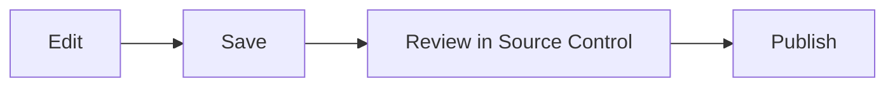

# Editing and Source Control

## Edit Markdown

Open a file, switch between rendered and source mode, and save normally. Nest
supports GitHub Flavored Markdown: tables, task lists, fenced code, links,
local images, and Mermaid diagrams.

## Status markers

- **M** modified · **A** new · **D** deleted

An amber dot on the Source Control icon means you have local changes. Open a
changed file from Source Control to compare it with the synced baseline.

## Discard

Discard restores a modified or deleted file, or removes a new one — undoing
unsaved intent, so review the diff first.

## After publishing

Use Source Control's refresh button. An approved request shows **Merge with
remote** — this makes the reviewed release the new baseline while keeping any
edits you made after submitting. A rejected request shows a badge; open
Messages to read the comment.
