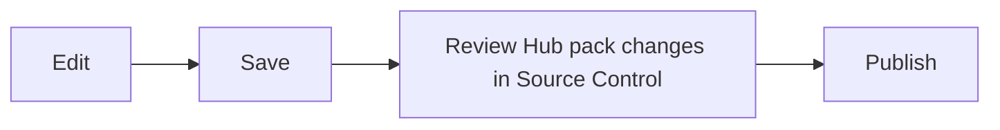

# Editing and Source Control

## Edit Markdown

Open a file, switch between rendered and source mode, and save normally. Nest
supports GitHub Flavored Markdown: tables, task lists, fenced code, links,
local images, Mermaid diagrams, and KaTeX math equations. Use `$E = mc^2$`
for inline math. For display math, put `$$` on separate lines around the
equation.

## What Source Control tracks

Source Control normally tracks editable packs installed from Hub. Ordinary
local-pack edits stay local and do not show change status. If you submit a
local pack to the registry, its submitted changes appear while the request is
under review.

Change colors and status badges appear only in Source Control, not Explorer.

## Status markers

- **M** modified · **A** new · **D** deleted

An amber dot on the Source Control icon means you have local changes. Open a
changed file from Source Control to compare it with the synced baseline.

## Discard

Discard restores a modified or deleted file, or removes a new one — undoing
unsaved intent, so review the diff first.

## After publishing

While a request is under review, the pack is locked and its submitted changes
remain visible but cannot be edited or discarded. Follow the inline link to
**Under Review** if you need to cancel and unlock it.

Use Source Control's refresh button. An approved request shows **Merge with
remote** — this makes the reviewed release the new baseline. A rejected
request unlocks the pack; open Messages to read the reviewer comment.
