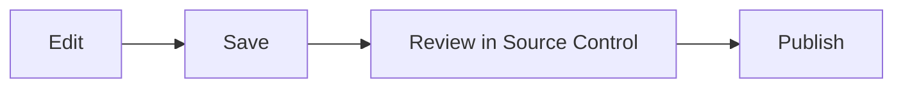

# Editing and Source Control

## Edit Markdown

Open a Markdown file and switch between rendered and source modes. Save changes
normally; the editor and Source Control share the same file state, so discarding
a change also restores the open editor.

Nest supports GitHub Flavored Markdown, including tables, task lists,
strikethrough, fenced code, links, local images, and Mermaid diagrams.

## Understand status markers

- **M** means a tracked file was modified.
- **A** means a file is new.
- **D** means a file was deleted.

The amber dot on the Source Control icon means at least one local change exists.
Open a changed file from Source Control to compare it with the synchronized
baseline.

## Discard carefully

Discard restores a modified or deleted file from the baseline and removes a new
file. This also updates an already-open editor. Review the diff before
discarding because unsaved intent cannot be reconstructed afterward.

## Synchronize review state

Use the Source Control refresh button after publishing. An approved request
advances the baseline and clears resolved changes. A rejected request releases
the pending lock and displays a rejection badge; open Messages from that badge
to read the review comment.
