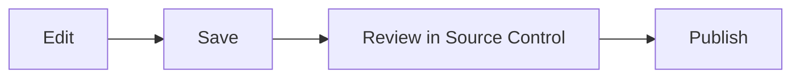

# Editing and Source Control

Open **Source Control** from the branching icon in the activity bar on the far
left. Hover the icon to see its name.

## Edit Markdown

Open a file, switch between rendered and source mode, and save normally. Nest
supports GitHub Flavored Markdown: tables, task lists, fenced code, links,
local images, and Mermaid diagrams.

## Status markers

- **M** modified · **A** new · **D** deleted

An amber dot on the Source Control icon means you have local changes. Open a
changed file from Source Control to compare it with the synced baseline.

## Review Agent proposals

Agent proposals use a separate review path from Source Control. The rendered
Markdown previews the pending proposal immediately. Choose **Review in editor**
from Chat (or open the proposal banner) to see one unified inline diff with old
and new line numbers. **Approve** writes the proposal and adds the resulting
local change to Source Control; **Reject** discards it. If you continue chatting
first, Agent builds follow-up work on the unresolved proposed version.

## Discard

Discard restores a modified or deleted file, or removes a new one — undoing
unsaved intent, so review the diff first.

## After publishing

While a request is pending, the pack is read-only and identifies who submitted
it. Only the original submitter sees the cancellation link. Use Source
Control's refresh button. An approved request shows **Merge with remote**;
non-conflicting files merge automatically and conflicting files ask you to
choose **Local** or **Approved Hub**. A rejected request shows a badge; open
**Messages** in the upper-right header to read the comment.
