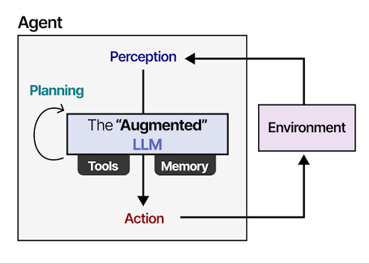
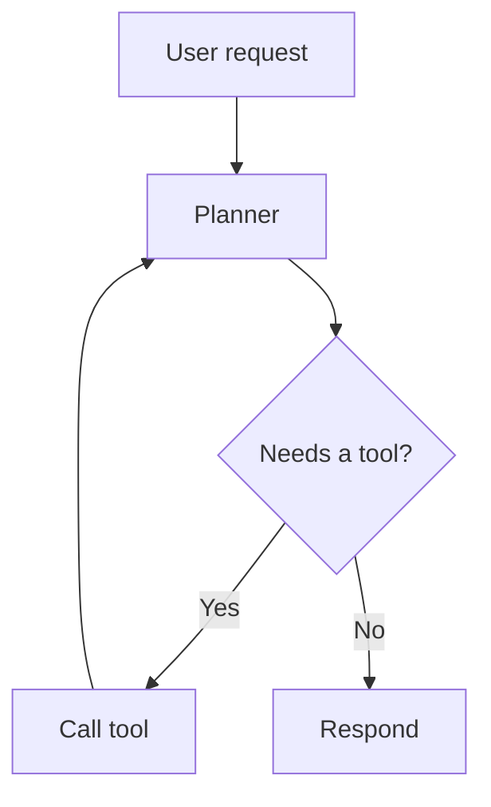

# LLM Agents

Notes on structuring LLM agent workflows: perception, planning, tool use, and memory.

## Workflow overview



## Control flow



## Example tool call

```ts
async function callTool(name: string, args: Record<string, unknown>) {
  const tool = tools.get(name);
  if (!tool) throw new Error(`Unknown tool: ${name}`);
  return tool.run(args);
}
```

## Reference


